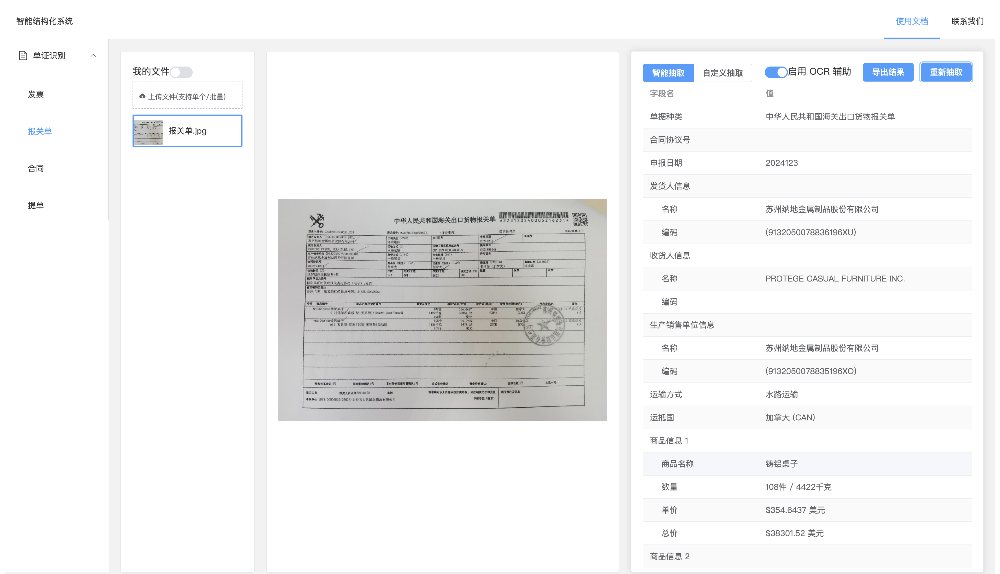
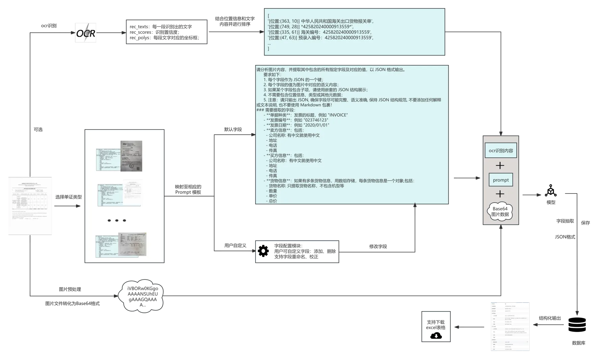

# 单证智能抽取系统
本项目针对国际业务中**报关单、提单、发票**等单证图像的⼈⼯处理效率低、多语⾔/⼿写体识别难等问题，结合 **Qwen2.5-72B-Instruct 多模态模型**与**PaddleOCR** 技术，实现图像⽂本的⾃动化提取与结构化处理，提升数据流转效率。
# 📦 项目依赖
## ✅ 模型依赖
- **Qwen2.5-72B 多模态模型**   
请从阿里官方渠道获取，推荐部署为本地服务或通过 API 调用。 
若使用阿里云 DashScope 服务，需在 `.env` 文件中配置： 
```OPENAI_API_KEY=your_api_key_here```
- **PaddleOCR 文本检测与识别模型**  
默认使用 PaddleOCR PP-OCRv5_server_det模型进行文本检测,PP-OCRv5_server_rec进行文本识别。  
ocr模型会由 PaddleOCR 自动下载到本地缓存目录：~/.cache/paddle/models/，若需自定义本地模型路径，请在 .env 中指定：  
```TEXT_DETECTION_MODEL、TEXT_RECOGNITION_MODEL```
## ✅ 数据库配置
本项目使用 MySQL 作为默认数据库，用于存储上传文件元数据、抽取结果等信息。
配置项说明：
```env
DB_USER="root" # 数据库用户名，默认为root
DB_PASSWORD="12345678" # 数据库密码
DB_HOST="" # 数据库地址
DB_NAME="documents_db" # 数据库名称
```
## ✅ 其他依赖
Python >= 3.10  
PaddleOCR=3.0.0  
PaddlePaddle=3.0.0  
node>=18.17.0
npm=v9.6.7
# 🚀 安装与运行步骤
## 环境变量配置
请将 .env.example 复制为 .env 并根据实际情况填写配置
## 1. 前端启动（Vue）
```bash
cd frontend
nvm use 18.17.0
npm install
npm run dev
```
访问地址：http://localhost:5173 （默认 Vite 开发服务器）
## 2. 后端启动（FastAPI）
```bash
cd backend
uv venv
source .venv/bin/activate
uv sync
python main.py
```

# 项目截图展示

# 系统流程图
